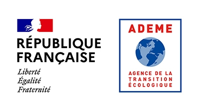

# _lidaRtRee_
# R package for forest analysis with airborne laser scanning data

`lidaRtRee` provides functions for forest objects detection, structure features computation, model calibration and mapping:

* co-registration of field plots with LiDAR data ([Monnet and Mermin (2014)](https://doi.org/10.3390/f5092307)); 
* tree detection (method 1 in [Eysn et al. (2015)](https://doi.org/10.3390/f6051721)) and segmentation; 
* forest parameters estimation with the area-based approach: model calibration with ground reference, and maps export;
* extraction of both physical (gaps, edges, trees) and statistical features from LiDAR data useful for e.g. habitat suitability modeling ([Glad et al. (2020)](https://doi.org/10.1002/rse2.117)) or forest maturity mapping ([Fuhr et al. (2022)](https://doi.org/10.1002/rse2.274)).

# Install

* `R` >= 4.2.3 recommended, package `lidR` >= 4.0.0 required.
* Install from [CRAN](https://cran.r-project.org/package=lidaRtRee), by running in the `R` console: `install.packages("lidaRtRee")`.
* Build development version from source with the `devtools` package: `devtools::install_git("https://forgemia.inra.fr/lidar/lidaRtRee")`.

# Tutorials

Tutorials using `lidaRtRee` functions are available in the [vignettes](https://forgemia.inra.fr/lidar/lidaRtRee/-/tree/main/vignettes) folder as `Rmarkdown` files, including datasets to run the code. The available tutorials are:

* [ALS data pre-processing](https://lidar.pages.mia.inra.fr/lidaRtRee/articles/ALS_data_preprocessing.html).
* [Tree detection](https://lidar.pages.mia.inra.fr/lidaRtRee/articles/tree.detection.html).
* [Forest field plot coregistration with ALS data](https://lidar.pages.mia.inra.fr/lidaRtRee/articles/coregistration.html).
* [Forest gaps and edges detection](https://lidar.pages.mia.inra.fr/lidaRtRee/articles/gaps.edges.detection.html).
* [Forest structure metrics computation and mapping](https://lidar.pages.mia.inra.fr/lidaRtRee/articles/forest.structure.metrics.html).
* Area-based approach for forest parameters estimation:
  - [data preparation](https://lidar.pages.mia.inra.fr/lidaRtRee/articles/area-based.1.data.preparation.html), 
  - [model calibration](https://lidar.pages.mia.inra.fr/lidaRtRee/articles/area-based.2.model.calibration.html) and 
  - [mapping](https://lidar.pages.mia.inra.fr/lidaRtRee/articles/area-based.3.mapping.and.inference.html).
  
# Acknowledgements / funding

`lidaRtRee` development (2018-2021) was funded by the [ADEME](https://www.ademe.fr/en/frontpage/) (french Agency for Ecological Transition) through the [PROTEST](https://protest.inrae.fr/) project (grant 1703C0069 of the GRAINE program).

 

